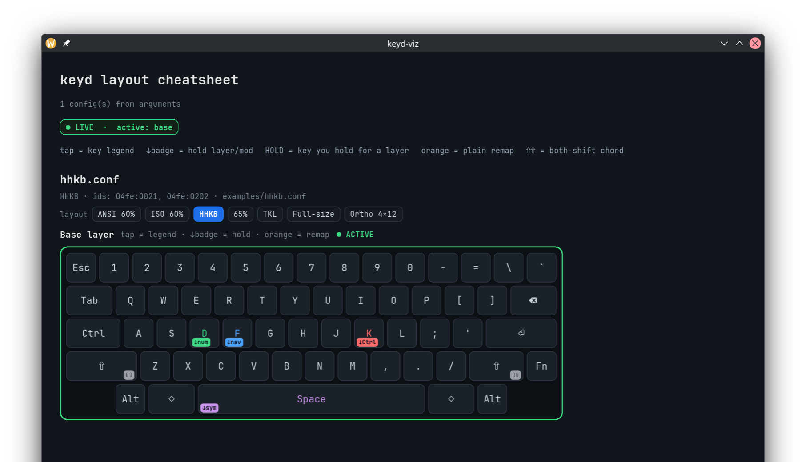

# keyd-cheatsheet

[](https://github.com/coffeeowl-labs/keyd-cheatsheet/actions/workflows/ci.yml)
[](LICENSE)

The visual face of [keyd](https://github.com/rvaiya/keyd): a native Linux GUI that draws your
keyboard from your keyd config and lights it up **live** — layer switches and keypresses as they
happen.

keyd is a brilliant config-file keyboard remapper, but unlike QMK/VIA there's no GUI to *see* your
layout. Once you have a few tap/hold layers going, it's easy to forget what `hold space` or
`hold f` actually does. keyd-viz parses your `.conf` files, draws them, and then shows the live
state as you type.



## What it does

- **Draws your real layout** from `/etc/keyd/*.conf` — a base board plus one board per layer, with
  keyd's tap/hold model rendered distinctly (tap legend on the key, hold action as a badge).
- **Live layer view** — the board follows keyd, switching to the active layer as you hold
  `nav`/`sym`/etc.
- **Live keypress glow** — caps light up as you press them, using keyd's *post-remap* output, so
  layer outputs and chords glow the right keys (nav `n` = `C-left` lights `n`, not the arrow).
- **Live config reload** — edit a `.conf` and the board redraws within ~1s, no restart.
- **Follows your keyboards** — detects connected devices and shows the matching config.

## Architecture

A Rust workspace plus a small system service:

- **`crates/core`** (`keydviz-core`) — pure keyd logic: the `.conf` parser, the board model, key
  naming. No I/O; fully unit-tested.
- **`crates/app`** (`keydviz`) — the [Slint](https://slint.dev) GUI.
- **`crates/helper`** (`keydviz-helperd`) — a tiny, hardened broker daemon that reads keyd's live
  state and streams it to the GUI, so you need **no special permissions** to see live layers and
  keypresses. See [`packaging/README.md`](packaging/README.md) for its security model (non-root,
  sandboxed, network-isolated, keypresses opt-in).

## Install

Build the GUI:

```sh
git clone https://github.com/coffeeowl-labs/keyd-cheatsheet
cd keyd-cheatsheet
cargo build --release -p keydviz        # -> target/release/keydviz
```

Install the broker service so the GUI gets live data with zero per-user setup:

```sh
./packaging/install.sh                  # layers only (safe default)
./packaging/install.sh --keys           # also enable keypress glow (reads /dev/input)
```

Then run it:

```sh
cargo run --release -p keydviz          # or: target/release/keydviz
```

The GUI auto-discovers the broker socket — no groups to join, no logout. Without the helper
installed it falls back to reading keyd directly (which needs membership in the `keyd`/`input`
groups); the helper is the recommended zero-permission path.

## Usage

```sh
keydviz                          # detect connected keyboards, show their /etc/keyd configs
keydviz examples/hhkb.conf       # render specific config(s)
keydviz --list                   # print the detection result and exit (no GUI)
keydviz --demo                   # cycle layers/keys with synthetic data (no keyd needed)
```

## How keyd bindings render

For each config it draws a **base board** plus **one board per layer**:

| keyd binding                          | shown as |
| ------------------------------------- | -------- |
| `f = lettermod(nav, f, ...)`          | key `F` with a `↓nav` badge; a `NAV` board where the held key is outlined `HOLD` |
| `k = lettermod(control, k, ...)`      | key `K` with a `↓Ctrl` badge |
| `capslock = overload(control, esc)`   | tap legend `Esc` + a `↓Ctrl` badge |
| `capslock = layer(control)`           | `Ctrl` (pure modifier), original legend ghosted |
| `leftcontrol = capslock`              | `Caps` (plain remap), original legend ghosted |
| `leftshift+rightshift = toggle(game)` | `⇧⇧` chord badge; a `GAME` board |
| `[nav] h = left`                      | `←` on the NAV board, the key's normal legend ghosted in the corner |

Physical layouts come from a curated catalog (pick one in-app), or import a board from QMK with
`--qmk-info <info.json>`.

## Development

```sh
cargo test --workspace
cargo clippy --workspace -- -D warnings
```

The broker crate links `libsystemd` (logind active-session check), so building it needs the
systemd dev headers (`libsystemd-dev` on Debian/Ubuntu; present by default on systemd distros).

See [`ROADMAP.md`](ROADMAP.md) for the design and what's next.

## License

MIT
